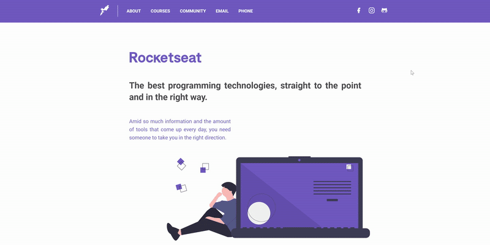

<h1 align="center">
    
</h1>

<h2 align="center">LaunchBase Bootcamp Challenges</h2>
<h3 align="center">Module 3 - Getting Started with Back-end Development</h3>

    <a href="#rocket-challenges">Challenges</a>&nbsp;&nbsp;&nbsp;|&nbsp;&nbsp;&nbsp;
    <a href="#computer-result">Result</a>&nbsp;&nbsp;&nbsp;|&nbsp;&nbsp;&nbsp;
    <a href="#memo-license">License</a>

## :rocket: Challenges

- [Challenge 3-1: Create your first Server](https://github.com/Rocketseat/bootcamp-launchbase-desafios-03/blob/master/desafios/03-1-primeiro-servidor.md)
- [Challenge 3-2: Nunjucks files and dynamic data](https://github.com/Rocketseat/bootcamp-launchbase-desafios-03/blob/master/desafios/03-2-nunjucks-e-dados-dinamicos.md)
- [Challenge 3-3: Course description page](https://github.com/Rocketseat/bootcamp-launchbase-desafios-03/blob/master/desafios/03-3-pagina-descricao-curso.md)

## :computer: Result

- [View code](https://github.com/MarianeAlgayer/launchbase-bootcamp/tree/master/module-3/challenges-3)

    

### Going the extra mile

During this module I also started my studies on Responsive Web Design and challenged myself to make my layout work well on different devices. 

    

## 📝 License

This project is under **MIT license**.

---

Made with 🖤 by [Mariane Algayer](https://github.com/MarianeAlgayer) 👋
