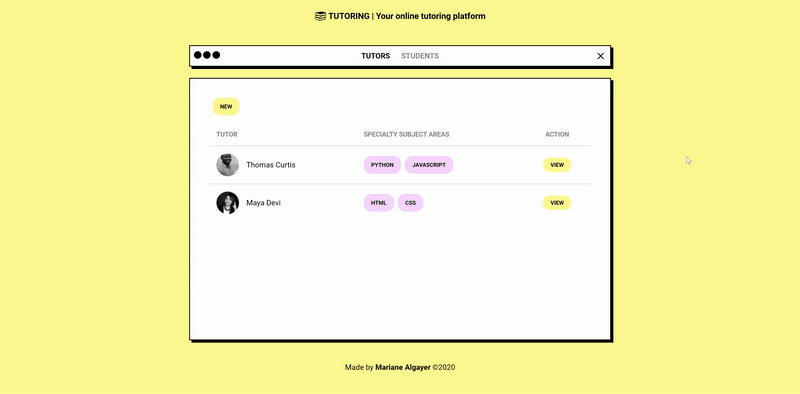

<h1 align="center">
    
</h1>

<h2 align="center">LaunchBase Bootcamp Challenges</h2>
<h3 align="center">Module 4 - Gym Manager</h3>

    <a href="#rocket-challenges">Challenges</a>&nbsp;&nbsp;&nbsp;|&nbsp;&nbsp;&nbsp;
    <a href="#computer-result">Result</a>&nbsp;&nbsp;&nbsp;|&nbsp;&nbsp;&nbsp;
    <a href="#memo-license">License</a>

## :rocket: Challenges

- [Challenge 4-1: Header](https://github.com/Rocketseat/bootcamp-launchbase-desafios-04/blob/master/desafios/04-1-header.md)
- [Challenge 4-2: Teacher card](https://github.com/Rocketseat/bootcamp-launchbase-desafios-04/blob/master/desafios/04-2-card-teacher.md)
- [Challenge 4-3: Form and teacher registration route](https://github.com/Rocketseat/bootcamp-launchbase-desafios-04/blob/master/desafios/04-3-form-and-routes-teacher.md)
- [Challenge 4-4: Structuring a teacher's data](https://github.com/Rocketseat/bootcamp-launchbase-desafios-04/blob/master/desafios/04-4-show-edit-format-teacher.md)
- [Challenge 4-5: HTTP: PUT and DELETE](https://github.com/Rocketseat/bootcamp-launchbase-desafios-04/blob/master/desafios/04-5-put-delete-teacher.md)
- [Challenge 4-6: List of teachers](https://github.com/Rocketseat/bootcamp-launchbase-desafios-04/blob/master/desafios/04-6-list-teachers.md)
- [Challenge 4-7: Structuring a student's data](https://github.com/Rocketseat/bootcamp-launchbase-desafios-04/blob/master/desafios/04-7-students.md)

## :computer: Result

- [View code](https://github.com/MarianeAlgayer/launchbase-bootcamp/tree/master/module-4/challenges-4)

    

## :memo: License

This project is under **MIT license**.

---

Made with 🖤 by [Mariane Algayer](https://github.com/MarianeAlgayer) 👋
