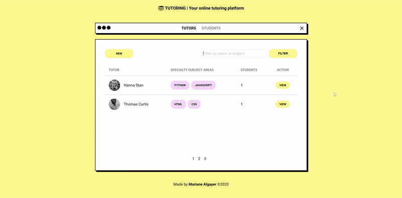

<h1 align="center">
    
</h1>

<h2 align="center">LaunchBase Bootcamp Challenges</h2>
<h3 align="center">Module 5 - Data Persistence</h3>

    <a href="#rocket-challenges">Challenges</a>&nbsp;&nbsp;&nbsp;|&nbsp;&nbsp;&nbsp;
    <a href="#computer-result">Result</a>&nbsp;&nbsp;&nbsp;|&nbsp;&nbsp;&nbsp;
    <a href="#memo-license">License</a>

## :rocket: Challenges

- [Challenge 5-1: Refactoring application and configuring the DB](https://github.com/rocketseat-education/bootcamp-launchbase-desafios-05/blob/master/desafios/05-1-refatorando-aplicacao.md)
- [Challenge 5-2: Interacting with the DB](https://github.com/rocketseat-education/bootcamp-launchbase-desafios-05/blob/master/desafios/05-2-interagindo-bd.md)
- [Challenge 5-3: Relationships and filters in the DB](https://github.com/rocketseat-education/bootcamp-launchbase-desafios-05/blob/master/desafios/05-3-relacionamentos-filtros-bd.md)
- [Challenge 5-4: Pagination of results in the DB](https://github.com/rocketseat-education/bootcamp-launchbase-desafios-05/blob/master/desafios/05-4-paginacao-bd.md)

## :computer: Result

- [View code](https://github.com/MarianeAlgayer/launchbase-bootcamp/tree/master/module-5/challenges-5)

    

## :memo: License

This project is under **MIT license**.

---

Made with 🖤 by [Mariane Algayer](https://github.com/MarianeAlgayer) 👋
